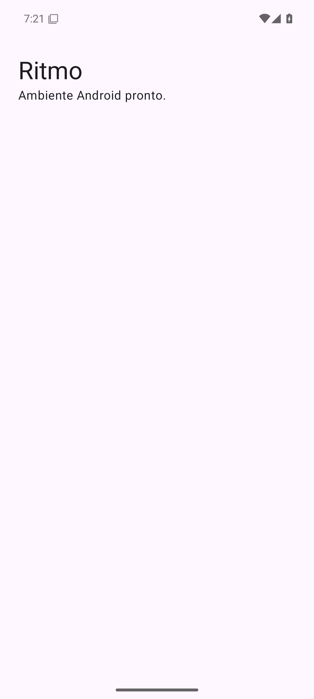

# SPRINT 00 — Development Environment & Git Workflow

## Equipe e objetivo

Team 09: Fernando Henrique Cobianchi (20220059497) e João Victor R. Peres (20230079303). Preparar ambiente, fork, branch, build e execução de uma aplicação mínima. Sem SPEC de funcionalidade nesta sprint.

## Ambiente

- Windows 10, unidade C:, fora do OneDrive.
- Android Studio Quail 4 / 2026.1.4.7, build AI-261.26222.65.2614.16204760.
- Android SDK em `C:\Android\Sdk`; plataforma 35, Build Tools 35.0.0, Platform Tools, Emulator e Command-line Tools 19.0.
- JDK Temurin 21.0.10; bytecode Java/Kotlin 17; Gradle 8.11.1; AGP 8.9.1; Kotlin 2.1.20.
- Emulador Pixel 6, Android 15/API 35, x86_64, WHPX, 2 GB RAM.
- Git e GitHub CLI autenticado em `botist`; GitHub Desktop 3.6.6 instalado. Os comandos de Git foram executados pela CLI equivalente.
- Fork: https://github.com/botist/mobile-development-2026-2
- Clone: `C:\Users\Fernando\Projects\mobiledev\mobile-development-2026-2`.
- Branch criada antes da implementação: `team-09/sprint-00`.

## Validação

| Critério oficial | Resultado | Evidência |
| --- | --- | --- |
| AC-01 fork | PASS | URL acima |
| AC-02 clone | PASS | clone local com origin e upstream |
| AC-03 branch | PASS | histórico Git |
| AC-04 estrutura | PASS | `app/settings.gradle.kts` |
| AC-05 compilação | PASS | `evidence/sprint-00/build.txt` |
| AC-06 execução | PASS | tela Ritmo no emulador |
| AC-07 evidência | PASS | captura abaixo |
| AC-08 explicação pelos alunos | PENDENTE | revisão e demonstração individual |

## Problemas e soluções

A versão latest do SDK Manager delegou para uma CLI nova que dividiu incorretamente os identificadores com ponto e vírgula. Foi instalada a versão 19.0 do Command-line Tools e os pacotes foram instalados com os identificadores completos. A primeira tentativa de instalação ocorreu antes do término do boot; a execução foi repetida após `sys.boot_completed=1`.

## Conceitos para explicar

Fork é a cópia remota na conta do aluno; clone é a cópia local; branch isola um incremento; commit registra uma versão; push envia commits; Pull Request solicita revisão. O wrapper fixa a versão do Gradle, o SDK fornece APIs e ferramentas, e o emulador executa o APK compilado. Compilar e executar são verificações distintas.

## Uso de IA

| Item | Resposta |
| --- | --- |
| LLM/tool used | Codex |
| Task supported by the LLM | Configuração, projeto mínimo, build, execução e documentação |
| Main suggestion received | SDK local no C:, versões fixadas e evidência capturada com ADB |
| What the team changed manually | Não declarado; revisão humana ainda pendente |
| How the result was validated | Gradle, instalação real e captura do emulador pela ferramenta |

## Definition of Done

- [x] Ambiente preparado, app compilado e executado.
- [x] Evidência e relatório incluídos.
A explicação dos alunos será avaliada presencialmente ao final da disciplina.
- [ ] PR aprovado e integrado pelo professor.

Envio realizado em branch própria por Pull Request ao repositório do professor.

**Entrega pelo repositório:** [PR #19](https://github.com/brenofeliix/mobile-development-2026-2/pull/19), submetido ao professor. A avaliação presencial ocorre ao final da disciplina.
